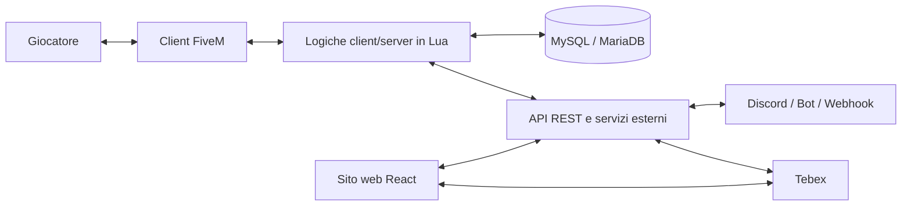
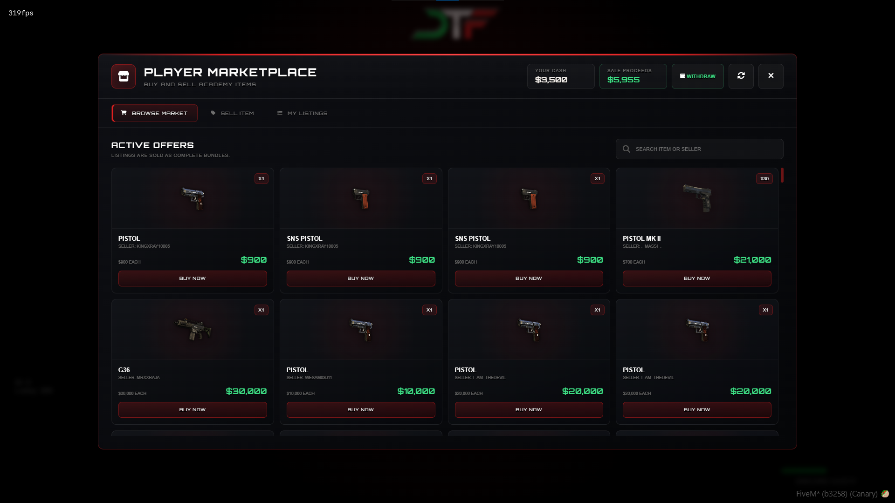
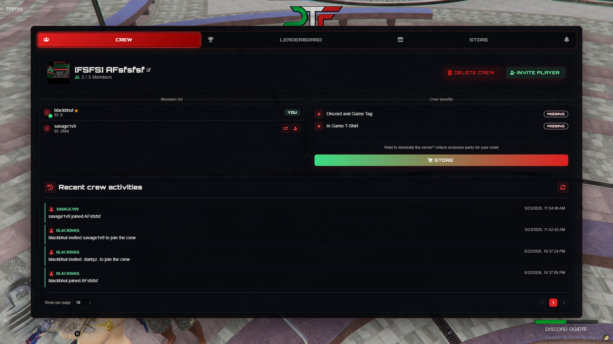
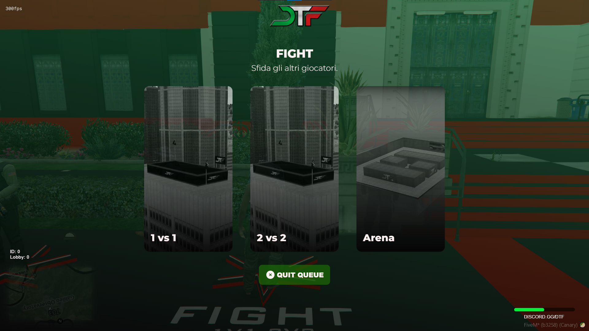
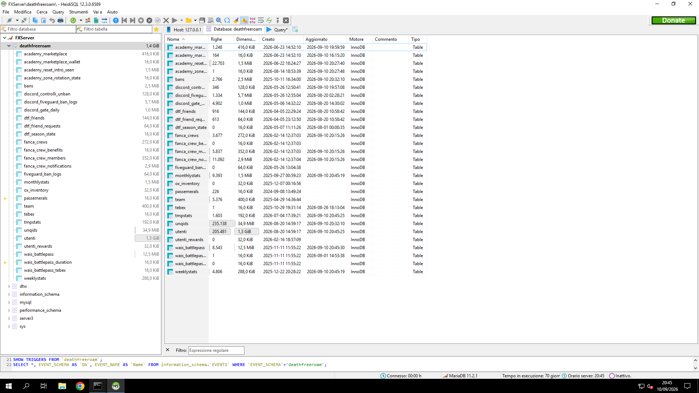
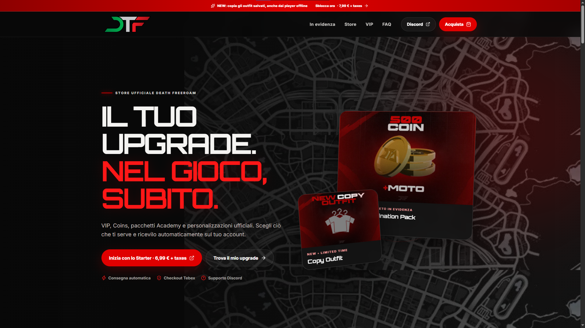
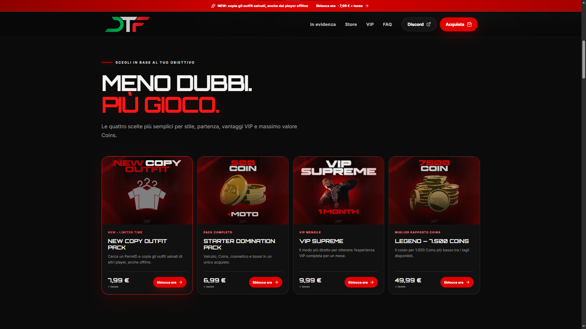
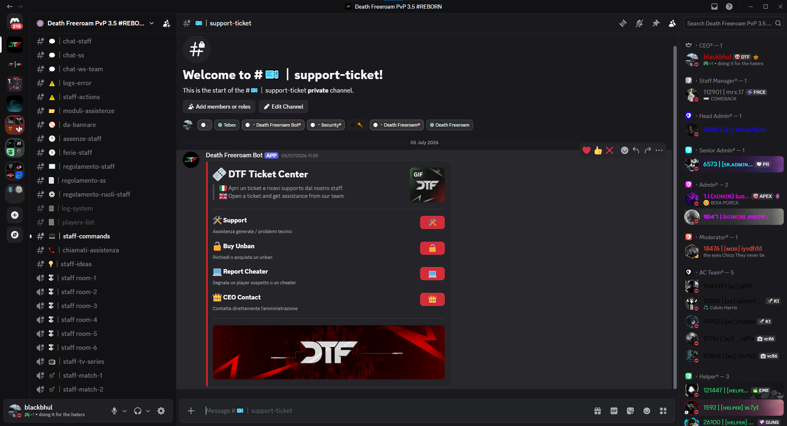
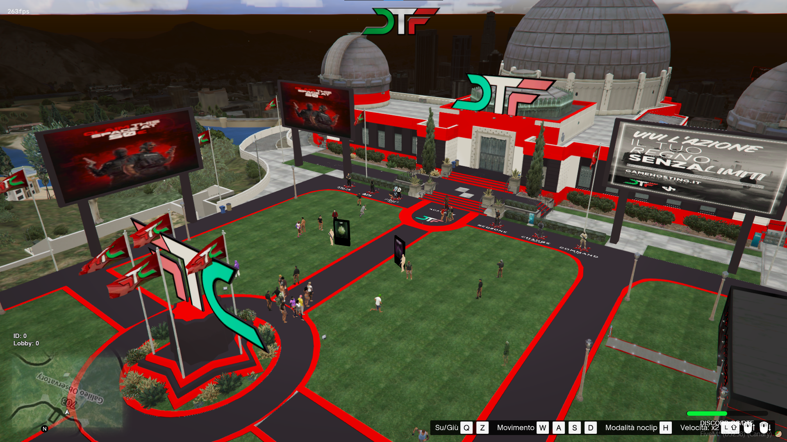

# Death Freeroam

### Piattaforma multiplayer FiveM — sviluppo software, database, integrazioni web e gestione di sistemi live

> **Ruolo:** Fondatore e Lead Developer  
> **Progetto attivo dal:** 2020  
> **Ambito:** sviluppo software, sistemi multiplayer, database, automazioni, integrazioni web e gestione infrastrutturale

---

## Panoramica

**Death Freeroam** è una piattaforma multiplayer sviluppata su FiveM e attiva dal 2020.

Il progetto nasce come ambiente PvP online, ma nel tempo si è evoluto in un ecosistema software composto da sistemi lato client e server, database relazionali, interfacce web, strumenti di amministrazione, sistemi di sicurezza, automazioni e integrazioni con servizi esterni.

Come **Fondatore e Lead Developer** ho seguito direttamente la progettazione e lo sviluppo delle principali funzionalità, la struttura dei dati, l'integrazione tra i diversi sistemi, il troubleshooting, l'ottimizzazione delle prestazioni e la gestione tecnica dell'infrastruttura.

Questo repository ha lo scopo di presentare il progetto come **caso di studio tecnico e professionale**. Il codice sorgente completo non è pubblico perché contiene componenti proprietari, logiche interne e configurazioni utilizzate in produzione.

---

## Il progetto in numeri

| Indicatore | Dato |
|---|---:|
| Progetto attivo | Dal 2020 |
| Community | **210.000+ utenti** |
| Giocatori complessivi registrati nelle statistiche | **520.000+** |
| Utenti attivi giornalieri | **circa 4.500** |
| Sessioni di gioco annue | **circa 2,9 milioni** |
| Staff attivo contemporaneamente | **circa 40 persone** |
| Persone passate complessivamente nello staff | **circa 500** |

I dati provengono dalle statistiche della community Discord e dal database di produzione del progetto.

---

## Il mio ruolo

Nel progetto mi occupo direttamente di:

- progettazione e sviluppo delle funzionalità software;
- sviluppo di logiche lato client e lato server;
- progettazione della struttura del database;
- creazione e manutenzione di tabelle e relazioni;
- scrittura di query SQL;
- sviluppo di interfacce web integrate;
- sviluppo del sito ufficiale in React;
- integrazione con API Tebex;
- integrazione con Discord, bot, webhook e API esterne;
- gestione dei sistemi di autenticazione e permessi;
- sviluppo di sistemi di logging e controllo;
- sviluppo e manutenzione di sistemi di sicurezza applicativa;
- debugging e troubleshooting di problemi in produzione;
- gestione e ottimizzazione delle prestazioni;
- amministrazione del server dedicato;
- gestione dei backup e monitoraggio dei servizi;
- coordinamento tecnico dello staff.

---

## Tecnologie utilizzate

### Sviluppo
- **Lua**
- **JavaScript**
- **HTML**
- **CSS**
- **SQL**
- **React**

### Database
- **MySQL**
- **MariaDB**

### Integrazioni
- **API REST**
- **Tebex API**
- **Discord**
- **Bot Discord**
- **Webhook**
- **API esterne**

### Infrastruttura
- **Server dedicato Windows**
- **RDP**
- gestione database;
- backup manuali;
- monitoraggio dei servizi;
- analisi dei log;
- troubleshooting in produzione.

---

## Architettura semplificata

L'architettura reale comprende numerosi moduli indipendenti e sistemi collegati tra loro. Il diagramma rappresenta in modo semplificato i principali flussi del progetto.

---

## Principali aree sviluppate

### Sistemi multiplayer e gestione delle sessioni

Ho sviluppato e mantenuto logiche dedicate alla gestione dei giocatori, delle sessioni e delle diverse modalità di gioco.

Tra queste rientrano sistemi di match integrati con Discord e funzionalità che coordinano dati di gioco, stato dei giocatori e servizi esterni.

L'obiettivo principale è mantenere sincronizzati i diversi componenti del sistema e garantire stabilità anche durante l'utilizzo contemporaneo da parte di numerosi utenti.

---

### Gestione utenti e persistenza dei dati

Gran parte delle funzionalità del progetto è basata sulla persistenza dei dati.

Ho progettato strutture e tabelle dedicate alla gestione di:

- utenti;
- identificativi permanenti;
- statistiche;
- inventari;
- squadre e gruppi;
- permessi;
- ricompense;
- stato delle funzionalità;
- attività;
- sistemi di sicurezza;
- configurazioni persistenti.

Le funzionalità lato server comunicano con MySQL/MariaDB per leggere, aggiornare e mantenere sincronizzati i dati dei giocatori.

---

### Marketplace interno

Ho sviluppato sistemi che permettono agli utenti di interagire con un marketplace interno alla piattaforma.

Il sistema gestisce offerte, vendite, acquisti, disponibilità degli elementi, dati economici e interazioni con il database.

L'interfaccia è integrata direttamente nell'ambiente FiveM e comunica con le logiche lato server.

---

### Gestione gruppi e attività

Il progetto comprende sistemi completi per la gestione di gruppi di utenti, membri, ruoli, benefici, inviti, statistiche e attività.

Le informazioni vengono gestite in modo persistente attraverso il database e sincronizzate con l'interfaccia utente.

---

### Sistemi di match

Sono presenti diverse modalità competitive con gestione delle code, assegnazione dei giocatori e controllo dello stato delle sessioni.

Alcuni sistemi sono collegati anche a Discord per automatizzare parti del flusso operativo e della comunicazione.

---

### Personalizzazione e dati disponibili anche offline

Ho sviluppato funzionalità che permettono di ricercare un utente tramite identificativo permanente e accedere a determinate configurazioni memorizzate nel database anche quando il giocatore non è connesso.

Un esempio è il sistema di gestione e copia delle configurazioni estetiche salvate, progettato per lavorare sui dati persistenti anziché dipendere esclusivamente dallo stato online dell'utente.

Questo tipo di funzionalità ha richiesto gestione degli identificativi, interrogazioni del database, sistemi di permessi e sincronizzazione tra interfaccia e server.

---

## Database e gestione dei dati

Il database rappresenta una parte centrale dell'architettura di Death Freeroam.

Ho progettato direttamente il database e le relative tabelle, occupandomi anche della scrittura e manutenzione delle query SQL.

Le attività comprendono:

- progettazione delle tabelle;
- definizione delle relazioni;
- lettura e aggiornamento dei dati;
- query con più tabelle;
- aggregazione di statistiche;
- gestione della persistenza;
- troubleshooting delle query;
- controllo delle prestazioni;
- manutenzione dei dati.

Il progetto utilizza **MySQL e MariaDB**.

---

## Interfacce web integrate

Per diversi sistemi ho sviluppato o integrato interfacce HTML, CSS e JavaScript direttamente nell'ambiente FiveM.

Pur concentrandomi principalmente sulla parte logica e funzionale, ho lavorato anche alla realizzazione e all'integrazione delle interfacce necessarie per rendere i sistemi utilizzabili dagli utenti.

Tra gli esempi presenti nel progetto:

- marketplace;
- gestione gruppi;
- modalità di gioco;
- pannelli di controllo;
- sistemi di personalizzazione;
- strumenti amministrativi.

Le interfacce comunicano con le logiche lato client e server e, quando necessario, con il database.

---

## Sito web e integrazione Tebex

Ho sviluppato anche il sito ufficiale di Death Freeroam utilizzando **React**.

Il sito presenta i prodotti e i servizi disponibili per la piattaforma e utilizza l'integrazione con **Tebex** per la gestione dello store e dei relativi flussi.

Il progetto comprende:

- interfaccia web responsive;
- presentazione dei prodotti;
- integrazione con API Tebex;
- collegamento diretto ai pacchetti;
- gestione dei flussi tra sito, store e community;
- integrazioni con Discord.

---

## Infrastruttura e gestione del sistema

Death Freeroam viene eseguito su un **server dedicato Windows**.

Mi occupo direttamente di diverse attività operative:

- accesso e amministrazione tramite RDP;
- gestione dei servizi;
- configurazione dell'ambiente;
- amministrazione del database;
- backup manuali;
- monitoraggio;
- analisi dei log;
- troubleshooting;
- verifica delle risorse utilizzate;
- gestione dei problemi legati a memoria e numero di giocatori;
- aggiornamenti e manutenzione del sistema.

L'attività viene svolta su un sistema reale in produzione, dove stabilità e tempi di intervento hanno un impatto diretto sugli utenti collegati.

---

## Prestazioni e troubleshooting

Una parte importante del lavoro riguarda l'analisi dei problemi e l'ottimizzazione dei sistemi.

Nel tempo ho lavorato su:

- gestione dell'utilizzo della memoria;
- stabilità con numerosi giocatori contemporanei;
- individuazione di script o processi problematici;
- analisi delle query SQL;
- verifica dei tempi di esecuzione;
- controllo dei log;
- debugging delle comunicazioni client/server;
- troubleshooting delle integrazioni;
- prevenzione di blocchi o comportamenti anomali.

Il lavoro viene svolto direttamente sull'ambiente di produzione e richiede la capacità di isolare rapidamente il componente responsabile del problema.

---

## Sicurezza applicativa

Ho sviluppato e mantenuto diversi sistemi dedicati alla protezione dell'ambiente e al controllo degli accessi.

Tra questi:

- autenticazione;
- sistemi di permessi;
- controllo dei ruoli;
- protezione degli eventi server;
- logging;
- gestione ban;
- sistemi anticheat;
- controllo di comportamenti anomali;
- tracciamento delle attività amministrative.

L'obiettivo è ridurre gli abusi, proteggere le funzionalità lato server e mantenere tracciabili le operazioni più sensibili.

---

## Integrazione con Discord e automazioni

Discord non viene utilizzato esclusivamente come strumento di comunicazione, ma è integrato con diverse funzioni operative del progetto.

Ho lavorato su:

- bot personalizzati;
- webhook;
- sistemi di ticket;
- gestione del supporto;
- automazioni legate agli utenti;
- collegamenti tra dati di gioco e Discord;
- gestione dei ruoli;
- notifiche;
- controlli automatici;
- integrazioni con sistemi di match.

Questo permette di collegare piattaforma di gioco, database e community all'interno di un unico flusso operativo.

---

## Testing e controllo qualità

Le funzionalità sviluppate vengono testate manualmente prima della pubblicazione e verificate nuovamente nell'ambiente live.

Il processo comprende principalmente:

- test funzionali;
- verifica dei flussi utente;
- controllo dell'interazione client/server;
- verifica delle letture e scritture sul database;
- analisi dei log;
- test delle integrazioni;
- verifica dopo aggiornamenti o modifiche;
- debugging degli errori riscontrati.

L'obiettivo è individuare problemi prima del rilascio e intervenire rapidamente quando un errore emerge in produzione.

---

## Coordinamento tecnico e gestione dello staff

Oltre allo sviluppo software, il progetto ha richiesto nel tempo anche la gestione di un'organizzazione tecnica e di supporto.

Attualmente sono presenti **circa 40 membri dello staff attivi contemporaneamente**.

Dal 2020, complessivamente, **circa 500 persone** hanno fatto parte dello staff nelle diverse fasi del progetto.

Mi occupo del coordinamento delle attività, della definizione dei ruoli, dell'organizzazione dei flussi operativi e della gestione degli strumenti utilizzati dallo staff.

---

## Interfaccia e ambiente del progetto

Death Freeroam dispone di una propria identità visiva e di ambienti personalizzati.

L'interfaccia e le funzionalità sono state progressivamente aggiornate per mantenere coerenza tra esperienza di gioco, strumenti interni, sito web e community.

---

## Competenze consolidate attraverso il progetto

Death Freeroam mi ha permesso di lavorare per diversi anni su un prodotto software reale, utilizzato quotidianamente da migliaia di utenti.

Le principali competenze consolidate sono:

- sviluppo software;
- progettazione di architetture applicative;
- programmazione lato client e server;
- database relazionali;
- progettazione e manutenzione SQL;
- integrazione di API;
- sviluppo web;
- React;
- automazione;
- debugging;
- troubleshooting;
- gestione di sistemi live;
- amministrazione server;
- monitoraggio;
- sicurezza applicativa;
- ottimizzazione delle prestazioni;
- problem solving tecnico;
- coordinamento di team;
- gestione di un prodotto digitale nel lungo periodo.

---

## Perché questo progetto è rilevante professionalmente

Death Freeroam non rappresenta soltanto un progetto legato al mondo gaming.

Dal punto di vista tecnico è un sistema software composto da più livelli che devono comunicare tra loro in modo stabile:

**client, server, database, interfacce web, API, servizi esterni, infrastruttura e strumenti di amministrazione.**

La gestione continuativa del progetto dal 2020 mi ha permesso di affrontare problemi reali di sviluppo, manutenzione, performance, sicurezza, scalabilità operativa e supporto agli utenti.

Il valore principale dell'esperienza è aver seguito un prodotto digitale durante l'intero ciclo di vita: dalla progettazione iniziale allo sviluppo, dal rilascio alla manutenzione quotidiana e all'evoluzione nel tempo.

---

## Codice sorgente

Il codice sorgente completo di Death Freeroam non viene pubblicato in questo repository.

Il progetto contiene software proprietario, sistemi utilizzati in produzione, configurazioni interne e componenti che non possono essere distribuiti pubblicamente.

Questo repository viene quindi utilizzato esclusivamente come **portfolio tecnico**, attraverso descrizioni, architettura, schermate e casi d'uso rappresentativi del lavoro svolto.

---

## Contatti

**Simone Maria Marino**  
Fondatore e Lead Developer — Death Freeroam

- LinkedIn: [Simone Marino](https://www.linkedin.com/in/simone-marino-2a5140226/)
- GitHub: [blackbhul](https://github.com/blackbhul)
- Sito Death Freeroam: *inserire qui il collegamento al sito ufficiale*
